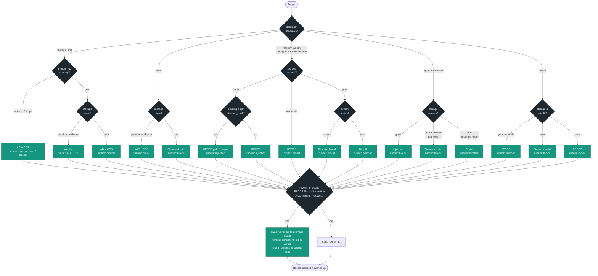

# Best-Use-of-Biomass Recommendation Logic

A flow chart of the deterministic decision tree in `scripts/build_recommendations.py`
(`decide()` plus the storage-access pre-step and the excess-nutrient post-step). The tree is
**first-match-wins** on the region's dominant feedstock. It encodes Frontier's KPI priority —
**CDR efficiency › emissions-avoiding co-product › other co-benefits** — modulated by storage
proximity, feedstock density, nutrient status, retrofit availability, and AD maturity.

Each teal leaf shows the **recommended** pathway (first line) and the *runner-up* (second line).
After the tree, a post-step can swap the runner-up to biomass burial in excess-nutrient regions.

## Inputs (per region)

| Input | Values | Source |
|---|---|---|
| `dominant_feedstock` | manure_wet · msw · forestry_woody · ag_dry · mixed | feedstock data |
| `feedstock_density` | concentrated · diffuse | feedstock data |
| `storage_access` | good · moderate · poor | computed (see pre-step) |
| `nutrient_status` | low · moderate · excess | feedstock data |
| `has_pp_or_bioenergy` | true / false — an existing, retrofittable pulp-&-paper or bioenergy mill physically in the region | facilities (point-in-polygon) |
| `manure_ad_preferred` | true / false — region is in a mature anaerobic-digestion country (e.g. Europe) | country list |

### Pre-step — storage access
Take the **more favourable** of (a) great-circle distance from the region centroid to the
nearest operational CCS site or high/medium-confidence basin, and (b) the best in-country
qualifying storage (handles large-country centroid bias). Then:

```
good      = within 500 km of qualifying storage  (or a high-confidence in-country basin / operational site)
moderate  = within 1000 km
poor      = otherwise, or only low-confidence storage nearby
```
`dry_removal` (the preferred distributed dry-biomass pathway) = **injection** if `storage = good`,
else **bio-oil** (pyrolysis densifies carbon, so bio-oil wins only when wells are far).

## Flow chart



## Notes & exclusions

- **Wet feedstocks never combust** — manure/biosolids route to injection or AD+CCS only.
- **Injection vs bio-oil** for dry residues turns on storage proximity: injection (>90% efficiency,
  cheaper on balance) wins where wells are near; bio-oil (~45%) wins at distance because
  pyrolysis densifies the carbon for cheaper transport.
- **AD+CCS** is preferred over injection for manure in mature-AD regions (Europe), where it
  retrofits existing biogas plants. RNG+CCS is **not** excluded — it is a viable offtake option.
- **Never recommended** (flagged): purpose-grown energy crops; corn-ethanol+CCS (US-scoped flag).
- The KPI score that orders the ranked list (and colours the map) is
  `60·CDR-efficiency + 25·(energy co-product) + 15·(co-benefit) − 10·(needs storage but poor access)`.

> Keep this chart in sync with `decide()` in `scripts/build_recommendations.py` if the logic changes.
