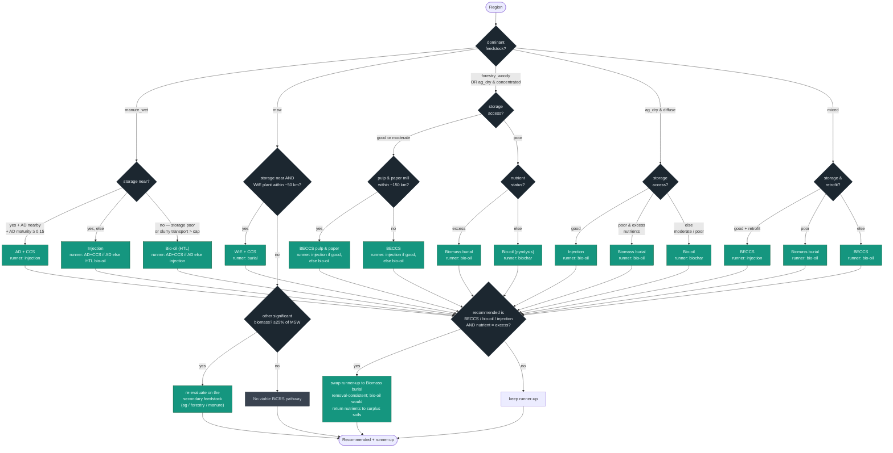

# Best-Use-of-Biomass Recommendation Logic

A flow chart of the deterministic decision tree in `scripts/build_recommendations.py`
(`decide()` plus the storage-access pre-step and the excess-nutrient post-step). The tree is
**first-match-wins** on the region's dominant feedstock. It encodes Frontier's KPI priority —
**CDR efficiency › emissions-avoiding co-product › other co-benefits** — modulated by storage
proximity, feedstock density, nutrient status, retrofit availability, and AD maturity.

Each teal leaf shows the **recommended** pathway (first line) and the *runner-up* (second line).
After the tree, a post-step can swap the runner-up to biomass burial in excess-nutrient regions.

## Inputs (per region)

| Input | Values | Source |
|---|---|---|
| `dominant_feedstock` | manure_wet · msw · forestry_woody · ag_dry · mixed | feedstock data |
| `feedstock_density` | concentrated · diffuse | feedstock data |
| `storage_access` | good · moderate · poor | computed (see pre-step) |
| `nutrient_status` | low · moderate · excess | feedstock data |
| `avail.pp` | true / false — an existing pulp & paper mill within ~150 km (pulpwood haul radius) | facilities (radius) |
| `avail.wte` | true / false — an existing waste-to-energy plant within ~50 km | facilities (radius) |
| `avail.ad` | true / false — cumulative anaerobic-digestion capacity within reach (~15 km for discrete digesters; regional clusters carry their own radius) ≥ a small threshold | facilities (radius + cumulative) |
| `manure_ad_preferred` | true / false — region's measured `ad_maturity` ≥ 0.15 (large existing AD industry to retrofit) | `ad_maturity.json` (IEA/FAOSTAT/IRENA/EBA; sub-national AgSTAR/CBA/ENSPRESO) |

### Retrofit-only gate
**BECCS pulp & paper (`beccs_pp`), WtE+CCS (`wte_ccs`), and AD+CCS (`ad_ccs`) only make sense as
retrofits of existing facilities today**, so each is recommendable — and only appears in the ranked
options — where the region is within the procurement radius of an existing facility of that type
(the `avail` flags). Outside the radius the tree falls back to a non-retrofit pathway (no mill →
plain BECCS / injection; no WtE → burial; no AD → injection or biochar). Plain BECCS
(heat/electricity) is **not** gated. At country scope the radius reduces to "a facility of that type
exists in the country". Facility coverage for the gate: pulp & paper and WtE from the global +
GHGRP/E-PRTR datasets; AD from EPA AgSTAR (US, county-aggregated) and EBA-based regional cumulative
clusters (EU/global).

### Pre-step — storage access
Take the **more favourable** of (a) great-circle distance from the region centroid to the
nearest operational CCS site or high/medium-confidence basin, and (b) the best in-country
qualifying storage (handles large-country centroid bias). Then:

```
good      = within 500 km of qualifying storage  (or a high-confidence in-country basin / operational site)
moderate  = within 1000 km
poor      = otherwise, or only low-confidence storage nearby
```
(US scope: distance is **replaced by transport cost** — `storage_access` = good ≤ $66 / moderate ≤ $100 /
poor > $100 per tCO₂, from the carbon-density-weighted multimodal delivered cost to the nearest operating
well; see METHODOLOGY §11. Each storage-dependent pathway is also disqualified above $100/tCO₂ for its own
payload — wet slurry hits the cap far sooner than densified bio-oil — falling back to bio-oil / burial /
biochar. Other scopes still use the distance bands above.)

`dry_removal` (the preferred distributed dry-biomass pathway) = **injection** if `storage = good`,
else **bio-oil** (pyrolysis densifies carbon, so bio-oil wins only when wells are far).

## Flow chart

> **Shareable, plain-language version:** `docs/recommendation_flowchart.png` (rendered from
> `docs/recommendation_flowchart.mmd`) — a simplified, colour-coded chart for non-technical
> colleagues. Re-render after edits with
> `mmdc -i docs/recommendation_flowchart.mmd -o docs/recommendation_flowchart.png -b white -s 3`.
> The detailed, code-faithful version (with runner-ups and the excess-nutrient post-step) is below.



## Notes & exclusions

- **Wet feedstocks (manure/biosolids)** route only to **injection, AD+CCS, or HTL bio-oil** — never
  combustion, and never biochar/burial (those need dry/solid biomass). Bio-oil (via hydrothermal
  liquefaction) leads only where storage is distant/expensive; direct injection is preferred when
  storage is near and affordable.
- **AD+CCS and injection both need geologic CO₂ storage** — AD+CCS captures a concentrated CO₂
  stream that must be injected, and injection places the slurry itself underground — so, exactly like
  BECCS and WtE+CCS, both require **storage proximity**. Where storage is poor, wet manure falls back
  to distributed **biochar** (the only storage-independent wet-manure CDR); AD+CCS / injection are not
  recommended there.
- **Injection vs bio-oil** for dry residues turns on storage proximity: injection (>90% efficiency,
  cheaper on balance) wins where wells are near; bio-oil (~45%) wins at distance because
  pyrolysis densifies the carbon for cheaper transport.
- **AD+CCS** is preferred over injection for manure where measured **AD maturity ≥ 0.15** *with storage
  near* (it retrofits an existing digester industry). `ad_maturity` = biogas/biomethane produced ÷
  sustainable potential (IEA/FAOSTAT/IRENA/EBA; sub-national from AgSTAR (US), Canadian Biogas
  Association (CA), ENSPRESO-density (EU)) — `data/processed/ad_maturity.json`, built by
  `scripts/build_ad_maturity.py`. This replaced a hardcoded "mature-AD country" list; the data flips
  ES/PL/IE to injection (large potential, little realized AD) and lifts Ontario/BC, California to AD+CCS.
  RNG+CCS is **not** excluded — it is a viable offtake option.
- **Cross-border storage** (US + Canada detail scopes): storage proximity ignores the border — a
  Canadian census division is scored against US wells/basins and vice-versa (e.g. southern
  Saskatchewan reaching the North Dakota Class VI wells / the US side of the Williston Basin).
- **Never recommended** (flagged): purpose-grown energy crops; corn-ethanol+CCS (US-scoped flag).
- The KPI score that orders the ranked list (and colours the map) is
  `60·CDR-efficiency + 25·(energy co-product) + 15·(co-benefit) − 10·(needs storage but poor access)`.

> Keep this chart in sync with `decide()` in `scripts/build_recommendations.py` if the logic changes.
